# Deployment Dossier: Simulation, SDR Replay, and Edge Demonstration

**Design baseline:** 2026-08-11  
**Status:** Tier 1 simulation is required; Tier 2/3 hardware is a gated stretch goal  
**Purchase gate:** G-5  
**Expected stretch outcome:** prerecorded demonstration

This dossier satisfies PR-9. It is an engineering design and planning estimate, not evidence that an RF deployment has run. Tier 1 remains the capstone deliverable. No hardware purchase, radiated test, or Tier 2/3 execution is authorized before G-5.

## 1. Deployment objective and boundary

The system demonstrates two pipelines on the same image and channel setting:

- **Learned arm:** image → DJSCC encoder → normalized complex symbols → channel → DJSCC decoder/classification head.
- **Classical arm:** image → JPEG 2000 → exact packet framing → 5G NR LDPC/rate matching → modulation → channel → demodulation/LDPC/JPEG 2000 decode → frozen classifier.

Tier 1 uses a reproducible PyTorch AWGN layer. Tier 2 replays frozen baseband I/Q through SDR hardware over a conducted cable path. Tier 3, if attempted, moves the user-facing path to a Raspberry Pi 4/5-class edge node. The Streamlit demo may run locally without SDR and must remain CPU-capable.

The SDR wrapper is a demonstration transport. Its preamble, pilots, synchronization, CFO, and device impairments are outside the Tier 1 statistical claim. Hardware frames must report wrapper overhead separately; they must not be presented as if they used the scientific symbol budget without overhead.

## 2. System architecture

```mermaid
flowchart LR
    A[Image input] --> B[Canonical preprocessing]
    B --> C1[DJSCC encoder]
    B --> C2[JPEG 2000 + packetizer + LDPC]
    C1 --> D1[k normalized complex symbols]
    C2 --> D2[k mapped complex symbols]
    D1 --> E[Frame wrapper: preamble, header, pilots, RRC]
    D2 --> E
    E --> F{Transport}
    F -->|Tier 1| G1[Keyed AWGN]
    F -->|Tier 2/3| G2[SDR TX → attenuator → SDR RX]
    G1 --> H[Symbol stream]
    G2 --> I[Timing/CFO correction + pilot SNR estimate]
    I --> H
    H --> J1[DJSCC decoder + task head]
    H --> J2[Demap + LDPC + J2K decode + frozen classifier]
    J1 --> K[Prediction, reconstruction, metrics]
    J2 --> K
    K --> L[Offline Streamlit comparison]
```



### 2.1 Process placement

| Tier | Sender | Channel | Receiver/UI | Scientific role |
|---|---|---|---|---|
| 1 | Workstation process | Differentiable/keyed AWGN | Same workstation | Required headline experiment |
| 2 | Workstation SDR process | Conducted RF cable + attenuation | Workstation SDR process | Optional replay/sensitivity demonstration |
| 3 | Raspberry Pi or split edge/workstation process | Conducted SDR path preferred | Edge node and local UI | Optional live demonstration |
| Fallback | Recorded Tier 1 or Tier 2 I/Q and screen capture | No live RF | Offline playback | Expected stretch outcome if hardware/latency fails |

## 3. Candidate hardware topology

The registered minimum is 1 Msps, I/Q playback and capture, a transmit-capable pair, and wired loopback with attenuation.

### Preferred cost-bounded candidate

```text
workstation or Raspberry Pi
        │ USB
        ▼
   HackRF One TX
        │ 50 Ω SMA cable
        ▼
 fixed attenuation + step attenuation + DC block
        │ 50 Ω SMA cable
        ▼
    RTL-SDR RX
        │ USB
        ▼
workstation or Raspberry Pi receiver process
```

This pairing fits the registered INR 25,000–40,000 envelope more plausibly than two imported ADALM-Pluto units. Its disadvantages are asymmetric converters, independent clocks, and limited calibration. Those disadvantages are acceptable for a replay demonstration only if synchronization, CFO estimation, and measured pilot SNR are shown.

### Higher-quality alternative

Two ADALM-Pluto units offer symmetric transmit/receive APIs and more convenient transceiver development, but the recorded procurement analysis places the pair at or above the top of the budget after import duty. Do not select it without a current quotation or institutional loan.

### Safety boundary

- Use conducted loopback first; no antennas are required for the capstone claim.
- Never connect a transmitter directly to an SDR receiver without verified attenuation and receiver-level calculation.
- Start at minimum transmitter gain and maximum attenuation.
- Include a DC block where either device can source bias voltage.
- Verify the receiver's maximum safe input from the exact vendor revision before connection.
- Radiated operation requires an institution-approved frequency, power, antenna, and local regulatory check. Until then, it is prohibited.

## 4. Provisional baseband and frame design

The design below is sufficient for budgeting and prototyping. It is not frozen scientific protocol. Freeze it only after G-5 and a software-only replay test.

### 4.1 Sampling and pulse shaping

| Parameter | Provisional value | Reason |
|---|---:|---|
| Complex device sample rate | 1.0 Msps | Registered hardware minimum and conservative for RTL-SDR USB operation |
| Samples per symbol | 4 | Timing recovery and RRC implementation margin |
| Complex symbol rate | 250 ksym/s | $1\text{ Msps}/4$ |
| RRC roll-off | 0.25 | Moderate occupied bandwidth and timing robustness |
| RRC span | 10 symbols | Finite implementation with manageable transient |
| Nominal occupied bandwidth | about 312.5 kHz | $R_s(1+\alpha)$ |
| Payload normalization | unit average complex-symbol power | Matches Tier 1 $E_s/N_0$ definition before SDR gain |

### 4.2 Frame layout

```text
| 128-symbol known BPSK preamble |
| 128-bit canonical header, repeated twice → 256 BPSK symbols |
| payload symbols with one known pilot after each 64 payload symbols |
| 32-symbol guard / RRC drain |
```

The 128-bit header budget is provisionally allocated to magic/version, system arm, bandwidth-ratio ID, modulation, LDPC-rate ID, payload-symbol count, sequence number, requested SNR setting, and header CRC. Exact bit positions and byte order must be frozen in a versioned schema before RF execution.

Preamble correlation provides frame detection and coarse timing. Repeated header bits provide a deliberately simple robust control path; the header CRC fails the whole frame closed. Pilots support residual phase/CFO tracking and post-receiver $E_s/N_0$ estimation. The payload is never silently resized: the receiver must recover exactly `k` scientific symbols or return an explicit frame failure.

### 4.3 Wrapper overhead

For payload length $k$, provisional wrapper symbols are

$$n_{wrap}=128+256+32+\left\lceil k/64\right\rceil=416+\left\lceil k/64\right\rceil.$$

| Imagenette-160 ratio | Payload $k$ | Wrapper symbols | Wrapper/payload | Air time at 250 ksym/s |
|---|---:|---:|---:|---:|
| 1/2 | 38,400 | 1,016 | 2.65% | 157.66 ms total |
| 1/3 headline baseline | 25,600 | 816 | 3.19% | 105.66 ms total |
| 1/6 | 12,800 | 616 | 4.81% | 53.66 ms total |
| 1/12 low-ratio baseline | 6,400 | 516 | 8.06% | 27.66 ms total |
| 1/48 | 1,600 | 441 | 27.56% | 8.16 ms total |

The high percentage at the smallest payload is exactly why wrapper overhead cannot be hidden. Hardware results must show both the scientific payload budget and total transmitted symbols.

## 5. SNR realization and link-budget estimate

Tier 1 defines SNR as $E_s/N_0$ in dB per normalized complex channel use. An SDR gain setting is not an SNR. Tier 2/3 therefore estimates post-synchronization SNR from known pilots and records the achieved value; it does not label a frame solely by requested attenuation.

### 5.1 Conducted-path planning estimate

Assumptions for a first safety calculation:

- equivalent noise bandwidth $B \approx 312.5$ kHz;
- room-temperature thermal density $-174$ dBm/Hz;
- provisional receiver noise figure $NF=8$ dB;
- provisional transmitter output $P_{TX}=-20$ dBm at minimum/low gain;
- cable and connector loss is included in total attenuation;
- target grid is $-8$ to $18$ dB $E_s/N_0$.

Estimated input-referred noise is

$$N=-174+10\log_{10}(312{,}500)+8\approx-111.1\text{ dBm}.$$

The receiver signal target is therefore approximately

$$P_{RX}=N+SNR\in[-119.1,-93.1]\text{ dBm}.$$

At the provisional $-20$ dBm transmit level, total path attenuation would need to span roughly

$$L=P_{TX}-P_{RX}\in[73.1,99.1]\text{ dB}.$$

A practical conducted chain would combine fixed protection attenuation with a calibrated step attenuator. These figures are **planning estimates only**: inexpensive SDR gain, noise figure, and output power vary with frequency and device. Before decoding any image, measure receiver noise with the transmitter muted, measure pilot power, verify no ADC clipping, and close the loop on observed pilot SNR.

### 5.2 Calibration sequence

1. Terminate the receiver input and record the digital noise floor at every RX-gain setting.
2. Connect the attenuated transmitter at minimum TX gain; verify peak input is safely below the vendor limit.
3. Send preamble/pilot-only frames and measure constellation power, noise residual, CFO, clipping rate, and packet-detection rate.
4. Sweep attenuation monotonically from maximum attenuation toward the target; never begin at the strongest signal.
5. Fit requested setting to measured post-receiver $E_s/N_0$ and retain uncertainty/repeatability.
6. Replay a known symbol fixture before any image payload.
7. Report both requested and achieved SNR; bin scientific-looking plots only by achieved SNR.

## 6. Packet and failure semantics

| Failure | Required receiver outcome | Forbidden behavior |
|---|---|---|
| No preamble / timing lock | `frame_not_detected` | Reuse prior frame or prediction |
| Header CRC failure | `header_failure` | Guess payload length/system mode |
| Payload symbol underflow/overflow | `symbol_count_mismatch` | Truncate or pad silently |
| Classical LDPC failure | Existing explicit digital decode-failure/outage policy | Drop row from denominator |
| JPEG 2000 decode failure | Existing explicit codec/decode verdict | Substitute source image |
| Learned non-finite output | `learned_decode_failure` plus raw diagnostics | Clamp and continue silently |
| Pilot SNR unavailable | `snr_unmeasured` | Label by attenuator setting as achieved SNR |

Every frame record should bind: frame-schema version; frozen checkpoint or classical configuration identity; image/sample identity; payload `k`; wrapper-symbol count; requested and achieved SNR; SDR/device identifiers; sample rate; gains; attenuation; CFO estimate; clipping count; verdict; latency stages; and raw I/Q artifact hash when retained.

## 7. Latency budget

The registered live-demo budget is 500 ms. At the provisional 250 ksym/s rate, the physical transfer consumes 8.16–157.66 ms depending on ratio. A planning allocation for the worst 1/2-ratio frame is:

| Stage | Planning allocation |
|---|---:|
| Input acquisition and preprocessing | 20 ms |
| Sender encode/JPEG 2000/LDPC preparation | 60 ms |
| Frame construction and USB buffering | 20 ms |
| Conducted transmission | 158 ms |
| Synchronization, CFO correction, demodulation | 30 ms |
| Receiver decode and classifier inference | 160 ms |
| UI update | 30 ms |
| **Total allocation** | **478 ms** |

At the provisional 1/3 ratio the transmission term falls to about 106 ms, giving a 426 ms allocation. These are budgets, not measurements. USB buffering and CPU LDPC decoding are the largest risks. The implementation must timestamp stage boundaries with one monotonic clock, report the configured latency statistic alongside median/p95/max, and use the registered prerecorded fallback rather than weakening the scientific model if the live edge path misses 500 ms.

Possible latency reductions that do not change scientific outputs:

- precompute both arms' payload symbols for a fixed demonstration image;
- use SDR streaming buffers rather than process-per-frame startup;
- keep model/checkpoint and LDPC graph resident;
- move the receiver pipeline to the workstation while retaining the Raspberry Pi as controller/UI; and
- replay recorded I/Q if live timing remains unstable.

Do not reduce image resolution, symbol budget, model width, or LDPC iterations and then label the result as the frozen Tier 1 system.

## 8. Energy estimate

No target hardware has been purchased, so energy is a bounded planning estimate. Assume an 8 W edge-compute draw during a 0.35–0.48 s frame and 3 W combined SDR draw during 0.11–0.16 s of active transfer:

$$E_{compute}\approx 8\times[0.35,0.48]=[2.8,3.84]\text{ J/frame},$$

$$E_{SDR}\approx 3\times[0.11,0.16]=[0.33,0.48]\text{ J/frame},$$

for an estimated active-system range of about **3.1–4.3 J/frame**, excluding display, power-supply loss, and idle energy. At a nominal 10 mW RF output, radiated/conducted RF energy over 106 ms would be about 1.06 mJ; computation and SDR electronics dominate the system estimate.

Before making any energy claim:

1. measure wall-input or DC rail power for idle, preprocessing, transmit, receive, and inference states;
2. integrate power over the same monotonic frame interval used for latency;
3. subtract idle only if both gross and incremental energy are reported;
4. report image ratio, `k`, hardware, software commit, and power-meter uncertainty; and
5. compare arms at the same completed task, not per successfully decoded frame only.

## 9. Procurement plan

No order is permitted before G-5. After G-5, obtain current quotations and select the least complex path that satisfies the demonstration.

| Item | Planning range (INR) | Need | Decision rule |
|---|---:|---|---|
| HackRF One-compatible transmitter + RTL-SDR receiver | 18,000–25,000 | I/Q playback/capture pair | Exact genuine-device capability and vendor support verified |
| Fixed/step attenuators, DC block, SMA cables, 50 Ω terminator | 3,000–5,000 | Safe conducted path | Mandatory before TX/RX connection |
| Raspberry Pi 4/5-class node, supply, storage | 7,000–10,000 | Tier 3 edge attempt | Borrow existing unit where possible; omit if Tier 2 only |
| **Total planning envelope** | **28,000–40,000** | Stretch deployment | Must remain inside the registered INR 25,000–40,000 envelope or use institutional loan/fallback |

The two-Pluto alternative requires a separate quotation and is expected to exceed the envelope. Procurement records should capture model/revision, seller, warranty, delivery date, tax/import duty, and return policy.

## 10. Deployment verification ladder

Execution after G-5 proceeds in order; a failed rung triggers diagnosis or fallback, not a skip:

1. **Software frame loopback:** exact header/payload recovery through RRC, timing offset, and CFO fixtures.
2. **File-backed I/Q replay:** sender writes canonical I/Q; receiver recovers exact known payload and measures injected SNR.
3. **SDR receive-only calibration:** terminated noise floor and known signal generator/borrowed source if available.
4. **Conducted single-frame loopback:** maximum attenuation, minimum TX gain, no image data.
5. **Conducted SNR sweep:** pilot-only then deterministic symbol fixtures across the registered SNR range.
6. **Frozen validation image replay:** both arms, exact symbol counts, explicit failures, no training and no test access.
7. **Latency and power characterization:** stage timing and energy under steady-state streaming.
8. **Demo rehearsal:** same image, SNR control, side-by-side outputs, frozen plot, offline operation.
9. **Prerecorded fallback capture:** recorded even if live operation succeeds.

## 11. Risks and mitigations

| Risk | Consequence | Mitigation/fallback |
|---|---|---|
| Receiver overload | Hardware damage or clipped evidence | Conducted path, fixed protection attenuation, minimum TX gain, vendor-limit check |
| SDR clocks are independent | CFO/phase drift and packet loss | Preamble correlation, CFO estimate, pilot tracking, short frames |
| Gain setting is mistaken for SNR | Invalid comparison | Pilot-aided achieved-SNR measurement and noise-floor calibration |
| Wrapper dominates small `k` | Misleading bandwidth claim | Report payload and wrapper symbols separately; no Tier 1 equivalence claim |
| USB/CPU latency exceeds 500 ms | Live Tier 3 failure | Persistent processes, split compute, then prerecorded fallback |
| Pi cannot run frozen model/LDPC fast enough | Demo stalls | Workstation receiver with Pi controller; do not alter frozen science |
| Candidate hardware exceeds budget | Procurement failure | Borrow equipment, choose HackRF + RTL-SDR, or stop at prerecorded Tier 1 |
| Radiated transmission is noncompliant | Safety/legal issue | Conducted-only operation until written institutional/regulatory approval |
| RF result diverges from AWGN | Scope confusion | Label hardware as sensitivity/demo; record CFO, clipping, and measured SNR |
| Test data is reopened for demo tuning | Invalid final protocol | Use frozen validation/demo samples; demo consumes checkpoints/results only |
| Hardware work threatens report schedule | Tier 1/report delay | G-5 purchase gate and W14 stretch allocation; abandon hardware on gate failure |

## 12. Exit criteria

Tier 1 deployment is complete when the offline Streamlit application loads frozen checkpoints and result CSVs, drives both pipelines on one input with a common SNR setting, updates the frozen accuracy plot, performs no training or metric recomputation, and records end-to-end latency.

Tier 2 is complete only when conducted I/Q playback/capture recovers versioned frames, reports achieved pilot SNR and wrapper overhead, preserves explicit failure semantics, and produces a reproducible prerecorded demonstration.

Tier 3 is complete only if the selected edge placement meets the registered 500 ms live-demo latency budget without changing the frozen dataset, model, symbol budget, or scientific results. Otherwise the prerecorded demonstration is the correct, preregistered outcome.
