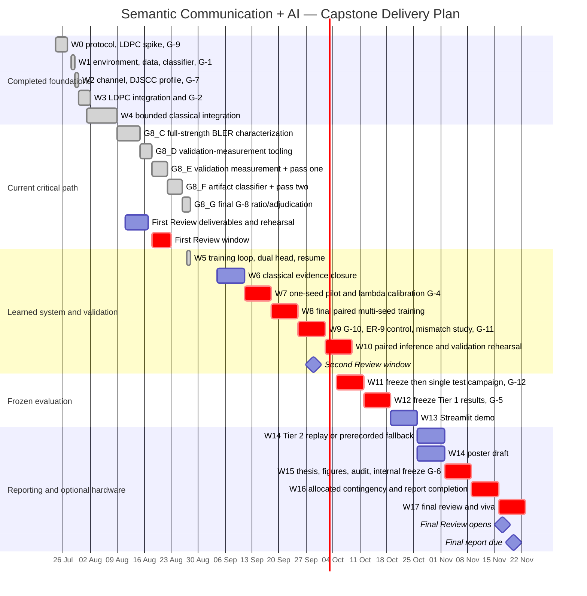

# Project Gantt Plan

**Baseline date:** 2026-08-27
**Owner:** project author  
**Control source:** [`spec/SPEC.md` §13](../spec/SPEC.md#13-schedule--gates)  
**Fixed review windows:** First 2026-08-18–22; Second 2026-09-29–10-03; Final 2026-11-17–21
**Final report and supporting material:** 2026-11-20

This is the maintained PR-2 time-plan artifact. `spec/SPEC.md` governs sequence and gates if this chart ever disagrees. Engineering checkpoints W0–W4 were completed ahead of the nominal teaching-week windows; the remaining bars preserve the normative gate order. Dates show the planned windows; status reflects authenticated repository evidence, not percentage estimates.

**Status correction (2026-08-27):** G8_E–G8_G and W5 are authenticated complete.
W5 was a training-infrastructure gate only: its bounded CUDA work is explicitly
non-scientific and selected no lambda, architecture, checkpoint or validation
result. Its additive optimizer-wide GradScaler accounting repair and successor
attempt-4 kill/resume smoke are GREEN; historical evidence remains immutable.
W6 is next but unopened; W7/G-4, W8 and test remain unexecuted/sealed.
Planned downstream windows preserve the normative order and fixed review dates.

## 1. Calendar view

## 2. Work breakdown, dependencies, and acceptance evidence

| Stream | Planned window | Depends on | Exit evidence | State at baseline |
|---|---:|---|---|---|
| W0 protocol and LDPC spike | By 27 Jul | Supervisor protocol decisions | G-9; golden-vector and throughput records | Complete |
| W1 reproducible foundation | 28–29 Jul | G-9 | G-1; pinned data manifests; clean classifier; sealed test boundary | Complete |
| W2 learned-system feasibility | 29–30 Jul | W1 | G-7 profile: batch 32, 1.004 GiB peak reserved VRAM, 48.68 s measured epoch | Complete |
| W3 digital physical layer | 30 Jul–2 Aug | W1 | G-2; exact packetisation and independent BLER agreement | Complete |
| W4 baseline integration | 1–9 Aug | W3 | Bounded JPEG 2000 + LDPC path; BR-4 selection machinery | Complete |
| G8_C BLER characterization | 9–15 Aug | G8_A/B contracts and manifests | Authenticated full-strength characterization coverage sufficient to freeze the BLER table | **Complete** — Pascal successor is 3,213/3,213; 153 measured-only curves and the successor `BlerTable` are frozen; predecessor contribution is zero |
| G8_D validation-measurement tooling | 15–18 Aug | G8_C exact coverage | Codec search, reconstruction cache, BR-11 accounting, count-derived records, atomic resume and bounded smoke | **Complete** — D0–D7 GREEN |
| G8_E full validation measurement + pass one | 18–21 Aug | G8_D GREEN and E0 | Validation-only measurements, measured accuracy records, one authorized pass-one selection and a training-only corpus specification | **Complete** — 288,000 rows authenticated; pass one frozen |
| G8_F artifact classifier and pass two | 22–25 Aug | G8_E GREEN | Training-only artifact corpus, fine-tuned artifact classifier, post-training validation scores and one authorized pass-two result | **Complete** — F1/F2/F3 closed; pass two executed exactly once |
| G8_G final G-8 adjudication | 26–27 Aug | G8_F GREEN | Final pass-two disposition; freeze `efficiency_ratio`, named `crossover_ratio`, `low_ratio_operating_point` and the G-8 outputs | **Complete** — G8 GREEN/CLOSED; ratios, BR-16 and H2 frozen |
| First Review package | 11–17 Aug | W0–W4 evidence | Polished 10–12-slide deck; ≥25-reference review; corrected Gantt; four-member technical readiness; viva evidence; deployment dossier plus guide acknowledgement; final package under `deliverables/review-1/`; `review-1-basis` tag | Backing documents complete; deck/export, four-member rehearsal, guide acknowledgement, final package and snapshot remain |
| W5 training system | 27 Aug | G8_G adjudication | Checkpoint/resume learned-system training loop and schema-exact records | **Complete** — optimizer-wide GradScaler accounting repaired; authenticated successor non-scientific CUDA plumbing; exact kill/resume; no selection |
| W6 classical evidence closure | 4–10 Sep | G8_G evidence | Classical-only implementation closure; artifact corpus and final pass-two outputs available | **Next; not authorized or started** |
| W7 pilot and λ calibration | 11–17 Sep | W5–W6 | One-seed pilot and G-4 | Not started |
| W8 headline training | 18–24 Sep | G-4 | Frozen multi-seed checkpoints at every selected ratio | Not started |
| W9 attribution and robustness | 25 Sep–1 Oct | W8 | G-10 decision; ER-9; H4 precision; G-11 | Not started |
| W10 validation rehearsal | 2–8 Oct | W9 | Paired full-grid validation rehearsal and Second Review figures | Not started |
| W11 single test campaign | 5–11 Oct | Freeze manifest and G-12 | One guarded test opening covering every registered test-reading experiment | Sealed/not started |
| W12 Tier 1 close | 12–18 Oct | W11 | Frozen ER-1–ER-4, ER-9, ER-10; every hypothesis decided; G-5 | Not started |
| W13 demo | 19–25 Oct | Frozen checkpoints/results | SNR slider, paired pipelines, frozen plot, latency record | Not started |
| W14 hardware/poster | 26 Oct–1 Nov | G-5 for purchase; Tier 2 readiness | SDR replay or prerecorded fallback; poster draft | Optional/not started |
| W15 internal report freeze | 2–8 Nov | Frozen results | Prescribed-format thesis, audit, novelty statement, plagiarism workflow | Not started |
| W16 contingency | 9–15 Nov | W15 | Report completion and audit only; no new scientific scope | Reserved |
| W17 final delivery | 16–22 Nov | Internal freeze | Final review, report and supporting material by 20 Nov, viva preparation | Not started |

## 3. Critical path and control rules

The scientific critical path is:

`G8_C → G8_D tooling → G8_E validation/pass one → G8_F artifact-classifier training/pass two → G8_G final G-8 ratio/adjudication → W5 learned-training infrastructure → W6 classical evidence closure → W7/G-4 λ calibration → W8 final training → G-10/G-11 → validation rehearsal → G-12 test release → G-5 Tier 1 freeze → report figures`.

Control rules:

1. **No downstream work crosses a gate.** G8_E full validation measurement and pass-one selection begin only after E0; G8_F waits for the immutable G8_E pass-one state; G8_G waits for the immutable G8_F pass-two state; learned-system training, calibration, final training and test access remain behind their later gates.
2. **The test split stays sealed until G-12.** Review demonstrations use validation data and are labelled accordingly.
3. **Hardware purchase is conditional on G-5.** Failure at G-5 abandons Tier 2/3 and moves effort to reporting.
4. **W16 is allocated contingency, not feature capacity.** It absorbs report completion and results-audit variance.
5. **Review dates do not move.** If scientific work slips, the review reports the actual state; it does not bypass a gate to manufacture a figure.
6. **The chart is revised at each review.** Changes record baseline date, changed bar, cause, effect on the critical path, and accepted fallback.
7. **First Review does not gate on later experiments.** G8_E, G8_F, G8_G, learned training/results, demo, thesis, poster, plagiarism workflow, hardware purchase and SDR work remain later tasks. Review 1 reports G8_C and G8_D as complete and the remaining work as future work rather than accelerating, weakening or bypassing a gate for presentation evidence.

## 4. Review checkpoints

| Review | Fixed window | Minimum evidence shown | Review purpose |
|---|---:|---|---|
| First | 18–22 Aug | All six rubric categories; problem/literature synthesis; completion objectives; exact corrected H1 rule; maintained Gantt; standards/tools register; G-1/G-2/G-7/W4 evidence; current G8_C/G8_D status; deployment path | Assess the motivation, proposal, subject understanding and practical execution plan |
| Second | 29 Sep–3 Oct | Frozen validation curves; G-10 crossover disposition; ER-9 design; validation-strength rehearsal; revised Gantt | Review progress, results-driven methodology and any permitted objective restatement |
| Final | 17–21 Nov | Frozen test results; hypothesis decisions; attribution control; demo; report/poster/supporting evidence | Final assessment and viva |

## 5. Current quantitative evidence available to the First Review

These are observed repository records, not forecasts:

- G-1: Imagenette-160 clean validation top-1 accuracy `898/1000 = 0.898`, above the `0.88` floor.
- G-7: the 1.64 M-parameter DJSCC profile ran a full 8,469-image epoch at batch size 32 in 48.68 s, reserving 1.004 GiB VRAM; 100 epochs projected to 1.35 h on the profiled device.
- G-2: golden vectors and all three independent BLER waterfall comparisons passed the 0.5 dB tolerance.
- W4: a bounded end-to-end classical run and its source-bound verifier pass.
- G8 is GREEN and closed: the Pascal BLER table, 288,000-row validation campaign, pass one, artifact scorer, pass two, operating ratios, BR-16 and H2 are frozen.
- W5 is complete as infrastructure only: optimizer-wide GradScaler accounting, exact fresh-process kill/resume and both selected-ratio gradient paths passed on successor CUDA attempt 4. Its smoke accuracy was not recorded and every checkpoint is machine-labelled ineligible.

No learned-vs-classical headline result exists yet. Historical First Review material must not present W5 smoke data as a scientific comparison.
